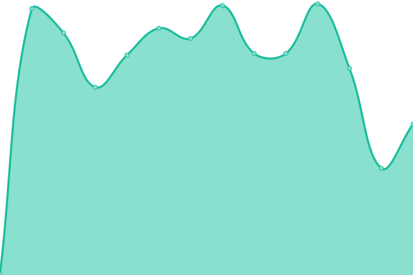

# [📈 Live Status](https://uptime.delmundo.info): <!--live status--> **🟧 Partial outage**

This repository contains the open-source uptime monitor and status page for [Jared Del Mundo](https://uptime.delmundo.info), powered by [Upptime](https://github.com/upptime/upptime).

With [Upptime](https://upptime.js.org), you can get your own unlimited and free uptime monitor and status page, powered entirely by a GitHub repository. We use [Issues](https://github.com/ricenoodler/delmundo.info-Uptime-Checker/issues) as incident reports, [Actions](https://github.com/ricenoodler/delmundo.info-Uptime-Checker/actions) as uptime monitors, and [Pages](https://uptime.delmundo.info) for the status page.

<!--start: status pages-->
<!-- This summary is generated by Upptime (https://github.com/upptime/upptime) -->
<!-- Do not edit this manually, your changes will be overwritten -->
<!-- prettier-ignore -->
| URL | Status | History | Response Time | Uptime |
| --- | ------ | ------- | ------------- | ------ |
|  [NextCloud](https://nextcloud.delmundo.info) | 🟩 Up | [next-cloud.yml](https://github.com/ricenoodler/delmundo.info-Uptime-Checker/commits/HEAD/history/next-cloud.yml) | 

 586ms
     
 | 

<a href="https://uptime.delmundo.info/history/next-cloud">100.00%</a>
    

|  [Immich](https://immich.delmundo.info) | 🟩 Up | [immich.yml](https://github.com/ricenoodler/delmundo.info-Uptime-Checker/commits/HEAD/history/immich.yml) | 

 350ms
     
 | 

<a href="https://uptime.delmundo.info/history/immich">100.00%</a>
    

|  [Jellyfin](https://jellyfin.delmundo.info) | 🟥 Down | [jellyfin.yml](https://github.com/ricenoodler/delmundo.info-Uptime-Checker/commits/HEAD/history/jellyfin.yml) | 

 0ms
     
 | 

<a href="https://uptime.delmundo.info/history/jellyfin">8.00%</a>
    

|  [Palworld Server](http://palworld.delmundo.info:3000/health) | 🟩 Up | [palworld-server.yml](https://github.com/ricenoodler/delmundo.info-Uptime-Checker/commits/HEAD/history/palworld-server.yml) | 

 300ms
     
 | 

<a href="https://uptime.delmundo.info/history/palworld-server">93.61%</a>
    

<!--end: status pages-->

[**Visit our status website →**](https://uptime.delmundo.info)

## 📄 License

- Powered by: [Upptime](https://github.com/upptime/upptime)
- Code: [MIT](./LICENSE) © [Anand Chowdhary](https://anandchowdhary.com), supported by [Pabio](https://pabio.com)
- Data in the `./history` directory: [Open Database License](https://opendatacommons.org/licenses/odbl/1-0/)
